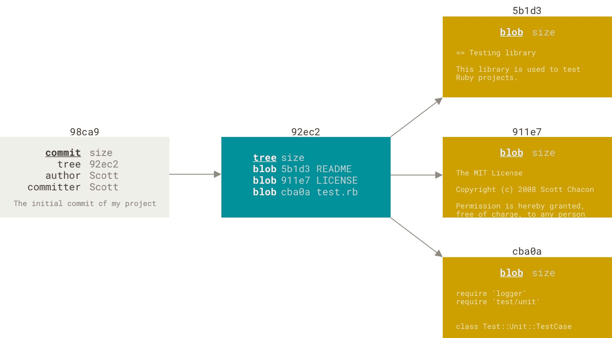

### 三种状态
已提交（committed）、已修改（modified） 和 已暂存（staged）
* 已修改表示修改了文件，但还没保存到数据库中。
* 已暂存表示对一个已修改文件的当前版本做了标记，使之包含在下次提交的快照中。
* 已提交表示数据已经安全地保存在本地数据库中。

Git项目拥有三个阶段：工作区， 暂存区， Git目录
Working Directory->git add->Staging Area-> git commit ->.git directory ->Working Directory

如果 Git 目录中保存着特定版本的文件，就属于已提交状态。 如果文件已修改并放入暂存区，就属于已暂存状态。 如果自上次检出后，作了修改但还没有放到暂存区域，就是已修改状态

gitconfig 文件：包含系统上每一个用户及他们仓库的通用配置，在执行git config 时带上--system选项时，就会读写该文件中的配置变量。 

.gitconfig 文件: 只针对当前用户。 传递 --global 选项让git读写此文件,这会对你系统上的所有仓库生效。
--local > --global > --system优先级从大到小.gitconfig 会覆盖gitconfig中的配置变量

查看所有配置以及它们所在的文件用命令 <br>
`git config --list --show-origin`
#### 用户信息 
安装完Git之后，第一件是配置好自己的用户名和邮件地址，否则git不知道你是谁，没法执行提交(commit)

配置整个系统的用--global选项，只作用当前仓库用--local选项也可以不带任何选项，命令如下：
`git config --global user.name "Tianuy"`<br>
`git config --global user.email "Tianuy-git@outlook.com"`

如果使用了--global选项，那么该命令只需要运行一次，以后你在该系统上做任何事，都会使用这些信息，如果要针对特定的项目使用不同的用户名和邮件地址时，可以运行不带--global选项的命令来配置。

#### 文本编辑器
如果不想使用默认的vim编辑器，可以这样做<br>
`git config --global core.editor "code --wait"`<br>

#### 检查配置信息
可以通过使用git config --list命令来列出所有git当时能找到的配置：
可以通过git config key:来检查git的某一项配置。
#### 获取帮助 
三种等价方法，可以找到git的综合手册：
git help verb
git verb --help
man git-verb
使用-h选项会获得更简明的“help”输出。

#### 记录每次更新到仓库
工作目录下的每一个文件都不外乎两中状态：**已跟踪，未跟踪**<br>已跟踪的文件是指那些被纳入了版本控制的文件，在上一次快照中有它们的记录，在工作一段时间后， 它们的状态可能是未修改，已修改或已放入暂存区。<br>
编辑过某些文件之后，由于自上次提交后你对它们做了修改，Git 将它们标记为已修改文件。 在工作时，你可以选择性地将这些修改过的文件放入暂存区，然后提交所有已暂存的修改，如此反复。


#### 检查当前文件状态
可以用git status 命令查看哪些文件处于什么状态。

### Git基础
能够配置并初始化一个仓库(repository)、开始或停止跟踪(track)文件、暂存(stage)或提交(commit)更改。
#### 获取git仓库
两种获取仓库的方法：
1. 将尚未进行版本控制的本地目录转换成Git仓库；
2. 从其他服务器克隆一个

使用git init 初始化一个仓库，该命令将创建一个名为 .git 的子目录，这个子目录含有你初始化的Git 仓库中所有的必须文件，这些文件是
Git 仓库的骨干。 但是，在这个时候，我们仅仅是做了一个初始化的操作，你的项目里的文件还没有被跟踪。

从根本上来讲 Git 是一个内容寻址
（content-addressable）文件系统，并在此之上提供了一个版本控制系统的用户界面。

.git 目录的典型结构如下：<br>
config<br>
description  
HEAD  
hooks/  
info/  
objects/  
refs/  
description 文件仅供 GitWeb 程序使用，我们无需关心。 config 文件包含项目特有的配置选项。 info 目录包含一个全局性排除（global exclude）文件， 用以放置那些不希望被记录在 .gitignore文件中的忽略模式（ignored patterns）。 hooks 目录包含客户端或服务端的钩子脚本（hook scripts）.

#### 核心组成部分
HEAD文件， objects目录(对象数据库)，尚待创建的index文件， refs目录
### Git 对象
Git 是一个内容寻址文件系统，核心部分是一个简单的键值对数据库（key-value data store）。 你可以向 Git 仓库中插入任意类型的内容，它会返回一个唯一的键，通过该键可以在任意时刻再次取回该内容。

Git
存储内容的方式——一个文件对应一条内容， 以该内容加上特定头部信息一起的 SHA-1 校验和为文件命名。 校
验和的前两个字符用于命名子目录，余下的 38 个字符则用作文件名。
一旦你将内容存储在了对象数据库中，那么可以通过 cat-file 命令从 Git 那里取回数据。 这个命令简直就是一把剖析 Git 对象的瑞士军刀。 为 cat-file 指定 -p 选项可指示该命令自动判断内容的类型，并为我们显示大致的内容

记住文件的每一个版本所对应的 SHA-1 值并不现实；另一个问题是，在这个（简单的版本控制）系统中，文件名并没有被保存,我们仅保存了文件的内容。

利用 git cat-file -t 命令，可以让 Git 告诉我们其内部存储的任何对象类型，只要给定该对象的 SHA-1 值：

#### 树对象
树对象（tree object），它能解决文件名保存的问题，也允许我们将多个文件组织到一起。 Git 以一种类似于 UNIX 文件系统的方式存储内容，但作了些许简化。 所有内容均以树对象和数据对象的形式存储，其中树对象对应了 UNIX 中的目录项，数据对象则大致上对应了 inodes 或文件内容。 一个树对象包含了一条或多条树对象记录（tree entry），每条记录含有一个指向数据对象或者子树对象的SHA-1 指针，以及相应的模式、类型、文件名信息。

在 Windows 的 CMD 中，字符 ^ 被用于转义，因此你必须双写它以避免出现问题：git cat-file -p master^^{tree}。 在 PowerShell 中使用字符 {} 时则必须用引号引起来，
以此来避免参数解析错误：git cat-file -p 'master^{tree}'。  

从概念上讲，Git 内部存储的数据有点像这样：
通常，Git 根据某一时刻暂存区（即 index 区域，下同）所表示的状态创建并记录一个对应的树对象， 如此重复便可依次记录（某个时间段内）一系列的树对象。 因此，为创建一个树对象，首先需要通过暂存一些文件来创建一个暂存区。 可以通过底层命令 git update-index 为一个单独文件——我们的 test.txt 文件的首个版本——创建一个暂存区。 利用该命令，可以把 test.txt 文件的首个版本人为地加入一个新的暂存区。 必须为上述命令指定 --add 选项，因为此前该文件并不在暂存区中（我们甚至都还没来得及创建一个暂存区呢）； 同样必需的还有--cacheinfo 选项，因为将要添加的文件位于 Git 数据库中，而不是位
于当前目录下。 同时，需要指定文件模式、SHA-1 与文件名：<br>
**这里太多了，省略一下，后面慢慢补充**

#### 跟踪新文件,暂存已修改文件
使用命令
`git add` 开始跟踪一个文件，暂存修改文件，已修改但未暂存的文件只会保留在本地磁盘，每次准备提交前都要先用`git status`看下，所需要的文件是否已经暂存起来了。

#### 忽略文件
总会有些文件无需纳入 Git 的管理，也不希望它们总出现在未跟踪文件列表。 通常都是些自动生成的文
件，比如日志文件，或者编译过程中创建的临时文件等。 在这种情况下，我们可以创建一个名为 .gitignore
的文件。
文件 .gitignore 的格式规范如下：
* 所有空行或者以 # 开头的行都会被 Git 忽略。
* 可以使用标准的 glob 模式匹配，它会递归地应用在整个工作区中。
* 匹配模式可以以（/）开头防止递归。
* 匹配模式可以以（/）结尾指定目录。
* 要忽略指定模式以外的文件或目录，可以在模式前加上叹号（!）取反。

所谓的 glob 模式是指 shell 所使用的简化了的正则表达式。 星号（*）匹配零个或多个任意字符；[abc] 匹配任何一个列在方括号中的字符 （这个例子要么匹配一个 a，要么匹配一个 b，要么匹配一个 c）； 问号（?）只匹配一个任意字符；如果在方括号中使用短划线分隔两个字符， 表示所有在这两个字符范围内的都可以匹配（比如 [0-9] 表示匹配所有 0 到 9 的数字）。 使用两个星号（**）表示匹配任意中间目录，比如 a/**/z 可以匹配 a/z 、 a/b/z 或 a/b/c/z 等。
.gitignore 文件的例子：
#### 查看已暂存和未暂存的修改
`git diff`能通过文件补丁的格式更加具体地显示哪些行发生了改变。此命令比较的是工作目录中当前文件和暂存区域快照之间的差异。 也就是修改之后还没有暂存起来的变化内
容。<br>
若要查看已暂存的和库里的（下次提交里的）内容，加上--staged选项，`git diff --staged`这条命令将比对已暂存文件与最后一次提交的文件差异：

#### 提交更新
运行命令`git commit`来提交，这样会启动你的文本编辑器来输入提交说明。默认的提交消息包含最后一次运行git status的输出，更详细的内容修改提示用-v选项查看，另外可以在commit命令后添加-m选项，将提交信息与命令放在同一行。如：
`git commit -m "story 182:fix banchmarks for speed"`
提交后它会告诉你，当前是在哪个分支（master）提交的，本次提交的完整 SHA-1 校验和是（463dc4f），以及在本次提交中，有多少文件修订过，多少行添加和删改过。提交时，记录的是暂存区域的快照。每次提交都是对这个区域做一次快照，以后可以回到这个状态。
#### 跳过使用暂存区域
在提交的时候，给 `git commit` 加上`-a` 选项，Git 就会自动把所有已经跟踪过的文件暂存起来一并提交，从而跳过 git add 步骤：`-a` 选项使本次提交包含了所有修改过的文件。 这很方便，但是要小心，有时这个选项会将**不需要的文件**添加到提交中。
#### 移除文件
从 Git 中移除某个文件，就必须要从已跟踪文件清单中移除（确切地说，是从暂存区域移除），然后提交。可以用`git rm`命令完成此项工作，并**连带从工作目录中删除指定的文件**，这样以后就不会出现在未跟踪文件清单中了。下一次提交时该文件就不再纳入版本管理了。如果要删除之前纳入版本管理的文件，需要添加`-f`选项。这是一种安全特性，用于防止误删尚未添加到快照的数据，这样的数据不能被 Git 恢复。

们想把文件从 Git 仓库中删除（亦即从暂存区域移除），但仍然希望保留在当前工作目录中。 换句话说，你想让文件保留在磁盘，但是并不想让 Git 继续跟踪。需要使用--cached选项。

#### 恢复文件以及一些学习过程中的理解
原书中是没有这一节的，是我在使用过程中，思考得到，但是这一节的内容是违背git的初衷的，一个优秀的版本管理软件，是不存在恢复这一说的，因为你的每一次提交都是正确的，必然是不存在恢复原来的状态，这就相当了一部分工作白做了，但是git确实是有这命令的，那就是`git restore`
直接使用该命令是从仓库中进行恢复，如果要从暂存区恢复，需要添加`--staged`选项。
部分理解，提交总是保证，库与提交时的暂存区保持一致，仓里有的，而提交时暂存区里没有，会删除库里的相关快照，没有的，会添加相应的快照。
#### 移动文件
使用`git mv `命令可以实现这一要求，如`git mv a b`它相当于执行了
```
mv a b
git rm a
git add b
```
#### 查看提交历史
提交了若干更新，又或者克隆了某个项目之后，你也许想回顾下提交历史。 完成这个任务最简单而又有效的
工具是 `git log` 命令。
不传入任何参数的默认情况下，git log 会按时间先后顺序列出所有的提交，最近的更新排在最上面。 正如你
所看到的，这个命令会列出每个提交的 SHA-1 校验和、作者的名字和电子邮件地址、提交时间以及提交说明。
比较有用的选项是 -p 或 --patch ，它会显示每次提交所引入的差异（按 补丁 的格式输出）。 限制显示的日志条目数量，例如使用 -2 选项来只显示最近的两次提交
--stat 选项在每次提交的下面列出所有被修改过的文件、有多少文件被修改了以及被修改过的文件的哪些行被移除或是添加了。 在每次提交的最后还有一个总结。
--pretty。 这个选项可以使用不同于默认格式的方式展示提交历史。 这个选项有一些内建的子选项供你使用。
最有意思的是 format ，可以定制记录的显示格式。
有跟多内容，可以自己查看官方文档，不再具体说明。
#### 撤销操作
提交完了才发现漏掉了几个文件没有添加，或者提交信息写错了。 此时，可以运行带有 `--amend` 选项的提交命令来重新提交：
`git commit --amend`这个命令会将暂存区中的文件提交。 如果自上次提交以来你还未做任何修改（例如，在上次提交后马上执行了此命令）， 那么快照会保持不变，而你所修改的只是提交信息。文本编辑器启动后，可以看到之前的提交信息。 编辑后保存会覆盖原来的提交信息。
实质是完全用一个 新的提交 替换旧的提交， 理解这一点非常重要。
#### 取消暂存的文件
使用`git reset HEAD <file>`...来取消暂存。也可以使用`git restore --staged <file>`来取消暂存。

#### 撤销对文件的修改
使用`git checkout --<file>`可以撤销修改，`git restore`也可以，现在似乎已经被`git restore`取代了

### 远程仓库的使用
为了能在任意 Git 项目上协作，你需要知道如何管理自己的远程仓库。 远程仓库是指托管在因特网或其他网络中的你的项目的版本库。 你可以有好几个远程仓库，通常有些仓库对你只读，有些则可以读写
#### 查看远程仓库
查看你已经配置的远程仓库服务器，可以运行`git remote` 命令，它会列出你指定的每一个远程服务器的简写。`-v`选项，会显示需要读写远程仓库使用的Git保存的简写与其对应的URL.
#### 添加远程仓库
两种方式：
1. 从其他服务器克隆一个，使用`git clone <url>`命令
2. 自己添加一个新的远程Git仓库，使用`git remote add <shortname> <url>`命令，同时指定一个方便使用的简写：
#### 从远程仓库中抓取与拉取
从远程仓库中获得数据，可以执行：
`git fetch <remote>`这个命令会访问远程仓库，从中拉取所有你还没有的数据.执行完成后，你将会拥有那个远程仓库中所有分支的引用，可以随时合并或查看

注意git fetch 命令只会将数据下载到你的本地仓库--并不会自动合并或修改你当前的工作，必须手动将其合并到你的工作。(我查看了现在的工作目录，确实如此，没有任何更改，合并，需要在当前分支设置跟踪远程分支，我现在还不知道，等知道了再回来补充)，如果是clone的仓库，使用git pull会自动合并到当前所在的分支。
#### 推送到远程仓库
分享你的项目时，必须将其推送到上游。 这个命令很简单：git push <remote> <branch>。 当你想要将 master 分支推送到 origin 服务器时（再次说明，克隆时通常会自动帮你设置好那两个名字）， 那么
运行这个命令就可以将你所做的备份到服务器：

只有当你有所克隆服务器的写入权限，并且之前没有人推送过时，这条命令才能生效。 当你和其他人在同一时间克隆，他们先推送到上游然后你再推送到上游，你的推送就会毫无疑问地被拒绝。推送失败，先放着。

#### 查看某个远程仓库
如果想要查看某一远程仓库的更多信息，可以使用`git remote show <remote>`命令，会列出远程仓库的 URL 与跟踪分支的信息

#### 远程仓库的重命名与移除
可以运行`git remote renmae`来修改一个远程仓库的简写名.
这也同样会修改你所有远程跟踪的分支名字。
想要移除一个远程仓库——你已经从服务器上搬走了或不再想使用某一个特定的镜像了， 又或者某一个贡献者不再贡献了——可以使用 `git remote remove` 或 `git remote rm`所有和这个远程仓库相关的远程跟踪分支以及配置信息也会一起被删除。

### 打标签
如何列出已有的标签、
如何创建和删除新的标签、以及不同类型的标签分别是什么。
#### 列出标签
使用`git tag`可带上`-l`选项`--list`
#### 创建标签
Git支持两种标签：轻量标签(lightweight)与附注标签(annotated)。
轻量标签很像一个不会改变的分支——它只是某个特定提交的引用。附注标签是存储在 Git 数据库中的一个完整对象， 它们是可以被校验的，其中包含打标签者的名字、电子邮件地址、日期时间， 此外还有一个标签信息，并且可以使用 GNU Privacy Guard （GPG）签名并验证。

##### 附注标签
在 Git 中创建附注标签十分简单。 最简单的方式是当你在运行 tag 命令时指定 -a 选项：<br>
`git tag -a v1.4 -m "my version 1.4"`  
`-m` 选项指定了一条将会存储在标签中的信息。 如果没有为附注标签指定一条信息，Git 会启动编辑器要求你输入信息。

通过使用 git show 命令可以看到标签信息和与之对应的提交信息.  
##### 轻量标签
创建轻量标签，不需要使用 -a、-s 或 -m 选项，只需要提供标签名字：
`git tag v1.4-lw`
在标签上运行 git show，你不会看到额外的标签信息。
#### 后期打标签  
要在指定的提交上打标签，你需要在命令的末尾指定提交的校验和（或部分校验和）：  
`git tag -a v1.2 9fcebo2`
#### 共享标签

默认情况下，git push 命令并不会传送标签到远程仓库服务器上。 在创建完标签后你必须显式地推送标签到
共享服务器上。 这个过程就像共享远程分支一样——你可以运行 `git push origin <tagname>`
如果想要一次性推送很多标签，也可以使用带有 `--tags` 选项的 `git push` 命令。 这将会把所有不在远程仓库服务器上的标签全部传送到那里。
#### 删除标签
要删除掉你本地仓库上的标签，可以使用命令 `git tag -d <tagname>`。
从任何远程仓库中移除这个标签，你必须用`git push <remote>
:refs/tags/<tagname>` 来更新你的远程仓库：
第一种变体是 `git push <remote> :refs/tags/<tagname>`
第二种更直观的删除远程标签的方式是：
`git push <remote> --delete <tagname>`
#### 检出标签
想查看某个标签所指向的文件版本，可以使用 ` git checkout `命令.
#### Git别名
Git 并不会在你输入部分命令时自动推断出你想要的命令。 如果不想每次都输入完整的 Git 命令，可以通过 `git config `文件来轻松地为每一个命令设置一个别名。 如：
`git config --global alias.ci commit`
当要输入git commit 时，只需要输入git ci就可以了

### Git 分支

进行提交操作时，Git会保存一个提交对象。提交对象会包含一个指向暂存内容快照的指针。 但不仅仅是这样，该提交对象还包含了作者的姓
名和邮箱、提交时输入的信息以及指向它的父对象的指针。 首次提交产生的提交对象没有父对象，普通提交操
作产生的提交对象有一个父对象， 而由多个分支合并产生的提交对象有多个父对象。

暂存操作会为每一个文件计算校验和（使用我们在 起步 中提到的 SHA-1 哈希算法），然后会把当前版本的文件快照保存到Git 仓库中 （Git 使用 blob 对象来保存它们），最终将校验和加入到暂存区域等待提交：

进行提交操作时，Git 会先计算每一个子目录（本例中只有项目根目录）的校验和， 然后
在 Git 仓库中这些校验和保存为树对象。随后，Git 便会创建一个提交对象， 它除了包含上面提到的那些信息
外，还包含指向这个树对象（项目根目录）的指针。

三种对象提交对象（包含着指向前述树对象的指针和所有提交信息），树对象（记录着目录结构和 blob 对象索引），blob对象（保存着文件快照）。


做些修改后再次提交，那么这次产生的提交对象会包含一个指向上次提交对象（父对象）的指针。

Git 的分支，其实本质上仅仅是指向提交对象的可变指针。 Git 的默认分支名字是 master。 在多次提交操作之后，你其实已经有一个指向最后那个提交对象的 master 分支。 master 分支会在每次提交时自动向前移动。

#### 分支创建
创建分支使用`git branch`命令，这会在当前所在的提交对象上创建一个指针。  

Git 又是怎么知道当前在哪一个分支上呢？ 也很简单，它有一个名为 HEAD 的特殊指针,指向当前所在的本地分支。可以将HEAD想象成当前分支的别名。

可以使用`git log`命令查看各个分支当前所指的对象，提供这一功能的参数是`--decorate`

#### 分支切换
要切换到一个已存在的分支，你需要使用 `git checkout` 命令
要切换到一个已存在的分支，你需要使用 `git checkout` 命令
创建新分支的同时切换过去，通常我们会在创建一个新分支后立即切换过去，这可以用` git checkout -b
<newbranchname> `一条命令搞定。

Git 的分支实质上仅是包含所指对象校验和（长度为 40 的 SHA-1 值字符串）的文件，所以它的创建和销毁
都异常高效。 创建一个新分支就相当于往一个文件中写入 41 个字节
（40 个字符和 1 个换行符）
#### 分支的新建与合并
使用 `git merge` 命令进行合并
