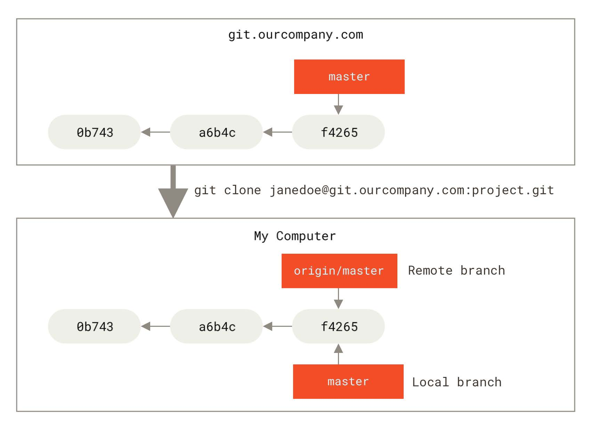

### 三种状态
已提交（committed）、已修改（modified） 和 已暂存（staged）
* 已修改表示修改了文件，但还没保存到数据库中。
* 已暂存表示对一个已修改文件的当前版本做了标记，使之包含在下次提交的快照中。
* 已提交表示数据已经安全地保存在本地数据库中。

Git项目拥有三个阶段：工作区， 暂存区， Git目录
Working Directory->git add->Staging Area-> git commit ->.git directory ->Working Directory

如果 Git 目录中保存着特定版本的文件，就属于已提交状态。 如果文件已修改并放入暂存区，就属于已暂存状态。 如果自上次检出后，作了修改但还没有放到暂存区域，就是已修改状态

gitconfig 文件：包含系统上每一个用户及他们仓库的通用配置，在执行git config 时带上--system选项时，就会读写该文件中的配置变量。 

.gitconfig 文件: 只针对当前用户。 传递 --global 选项让git读写此文件,这会对你系统上的所有仓库生效。
--local > --global > --system优先级从大到小.gitconfig 会覆盖gitconfig中的配置变量

查看所有配置以及它们所在的文件用命令 <br>
`git config --list --show-origin`
#### 用户信息 
安装完Git之后，第一件是配置好自己的用户名和邮件地址，否则git不知道你是谁，没法执行提交(commit)

配置整个系统的用--global选项，只作用当前仓库用--local选项也可以不带任何选项，命令如下：
`git config --global user.name "Tianuy"`<br>
`git config --global user.email "Tianuy-git@outlook.com"`

如果使用了--global选项，那么该命令只需要运行一次，以后你在该系统上做任何事，都会使用这些信息，如果要针对特定的项目使用不同的用户名和邮件地址时，可以运行不带--global选项的命令来配置。

#### 文本编辑器
如果不想使用默认的vim编辑器，可以这样做<br>
`git config --global core.editor "code --wait"`<br>

#### 检查配置信息
可以通过使用`git config --lis`t命令来列出所有git当时能找到的配置：
可以通过`git config <key>`:来检查git的某一项配置。
#### 获取帮助 
三种等价方法，可以找到git的综合手册  
```
git help verb
git verb --help
man git-verb
```
使用-h选项会获得更简明的“help”输出。

#### 记录每次更新到仓库
工作目录下的每一个文件都不外乎两中状态：**已跟踪，未跟踪**<br>
已跟踪的文件是指那些被纳入了版本控制的文件，在上一次快照中有它们的记录，在工作一段时间后， 它们的状态可能是未修改，已修改或已放入暂存区。<br>
编辑过某些文件之后，由于自上次提交后你对它们做了修改，Git 将它们标记为已修改文件。 在工作时，你可以选择性地将这些修改过的文件放入暂存区，然后提交所有已暂存的修改，如此反复。


#### 检查当前文件状态
可以用git status 命令查看哪些文件处于什么状态。

### Git基础
能够配置并初始化一个仓库(repository)、开始或停止跟踪(track)文件、暂存(stage)或提交(commit)更改。
#### 获取git仓库
两种获取仓库的方法：
1. 将尚未进行版本控制的本地目录转换成Git仓库；
2. 从其他服务器克隆一个

使用git init 初始化一个仓库，该命令将创建一个名为 .git 的子目录，这个子目录含有你初始化的Git 仓库中所有的必须文件，这些文件是Git 仓库的骨干。 但是，在这个时候，我们仅仅是做了一个初始化的操作，你的项目里的文件还没有被跟踪。

从根本上来讲 Git 是一个内容寻址（content-addressable）文件系统，并在此之上提供了一个版本控制系统的用户界面。

.git 目录的典型结构如下：<br>
config<br>
description  
HEAD  
hooks/  
info/  
objects/  
refs/  
description 文件仅供 GitWeb 程序使用，我们无需关心。 config 文件包含项目特有的配置选项。 info 目录包含一个全局性排除（global exclude）文件， 用以放置那些不希望被记录在 .gitignore文件中的忽略模式（ignored patterns）。 hooks 目录包含客户端或服务端的钩子脚本（hook scripts）.

#### 核心组成部分
HEAD文件， objects目录(对象数据库)，尚待创建的index文件， refs目录
### Git 对象
Git 是一个内容寻址文件系统，核心部分是一个简单的键值对数据库（key-value data store）。 你可以向 Git 仓库中插入任意类型的内容，它会返回一个唯一的键，通过该键可以在任意时刻再次取回该内容。

Git
存储内容的方式——一个文件对应一条内容， 以该内容加上特定头部信息一起的 SHA-1 校验和为文件命名。 校验和的前两个字符用于命名子目录，余下的 38 个字符则用作文件名。
一旦你将内容存储在了对象数据库中，那么可以通过 cat-file 命令从 Git 那里取回数据。 这个命令简直就是一把剖析 Git 对象的瑞士军刀。 为 cat-file 指定 -p 选项可指示该命令自动判断内容的类型，并为我们显示大致的内容.

记住文件的每一个版本所对应的 SHA-1 值并不现实；另一个问题是，在这个（简单的版本控制）系统中，文件名并没有被保存,我们仅保存了文件的内容。

利用 `git cat-file -t `命令，可以让 Git 告诉我们其内部存储的任何对象类型，只要给定该对象的 SHA-1 值：

#### 树对象
树对象（tree object），它能解决文件名保存的问题，也允许我们将多个文件组织到一起。 Git 以一种类似于 UNIX 文件系统的方式存储内容，但作了些许简化。 所有内容均以树对象和数据对象的形式存储，其中树对象对应了 UNIX 中的目录项，数据对象则大致上对应了 inodes 或文件内容。 一个树对象包含了一条或多条树对象记录（tree entry），每条记录含有一个指向数据对象或者子树对象的SHA-1 指针，以及相应的模式、类型、文件名信息。

在 Windows 的 CMD 中，字符 ^ 被用于转义，因此你必须双写它以避免出现问题：git cat-file -p master^^{tree}。 在 PowerShell 中使用字符 {} 时则必须用引号引起来，
以此来避免参数解析错误：git cat-file -p 'master^{tree}'。  

从概念上讲，Git 内部存储的数据有点像这样：
通常，Git 根据某一时刻暂存区（即 index 区域，下同）所表示的状态创建并记录一个对应的树对象， 如此重复便可依次记录（某个时间段内）一系列的树对象。 因此，为创建一个树对象，首先需要通过暂存一些文件来创建一个暂存区。 可以通过底层命令 git update-index 为一个单独文件——我们的 test.txt 文件的首个版本——创建一个暂存区。 利用该命令，可以把 test.txt 文件的首个版本人为地加入一个新的暂存区。 必须为上述命令指定 --add 选项，因为此前该文件并不在暂存区中（我们甚至都还没来得及创建一个暂存区呢）； 同样必需的还有--cacheinfo 选项，因为将要添加的文件位于 Git 数据库中，而不是位
于当前目录下。 同时，需要指定文件模式、SHA-1 与文件名：<br>
**这里太多了，省略一下，后面慢慢补充**

#### 跟踪新文件,暂存已修改文件
使用命令
`git add` 开始跟踪一个文件，暂存修改文件，已修改但未暂存的文件只会保留在本地磁盘，每次准备提交前都要先用`git status`看下，所需要的文件是否已经暂存起来了。

#### 忽略文件
总会有些文件无需纳入 Git 的管理，也不希望它们总出现在未跟踪文件列表。 通常都是些自动生成的文
件，比如日志文件，或者编译过程中创建的临时文件等。 在这种情况下，我们可以创建一个名为 .gitignore
的文件。
文件 .gitignore 的格式规范如下：
* 所有空行或者以 # 开头的行都会被 Git 忽略。
* 可以使用标准的 glob 模式匹配，它会递归地应用在整个工作区中。
* 匹配模式可以以（/）开头防止递归。
* 匹配模式可以以（/）结尾指定目录。
* 要忽略指定模式以外的文件或目录，可以在模式前加上叹号（!）取反。

所谓的 glob 模式是指 shell 所使用的简化了的正则表达式。 星号（*）匹配零个或多个任意字符；[abc] 匹配任何一个列在方括号中的字符 （这个例子要么匹配一个 a，要么匹配一个 b，要么匹配一个 c）； 问号（?）只匹配一个任意字符；如果在方括号中使用短划线分隔两个字符， 表示所有在这两个字符范围内的都可以匹配（比如 [0-9] 表示匹配所有 0 到 9 的数字）。 使用两个星号（**）表示匹配任意中间目录，比如 a/**/z 可以匹配 a/z 、 a/b/z 或 a/b/c/z 等。
.gitignore 文件的例子：
#### 查看已暂存和未暂存的修改
`git diff`能通过文件补丁的格式更加具体地显示哪些行发生了改变。此命令比较的是工作目录中当前文件和暂存区域快照之间的差异。 也就是修改之后还没有暂存起来的变化内
容。<br>
若要查看已暂存的和库里的（下次提交里的）内容，加上--staged选项，`git diff --staged`这条命令将比对已暂存文件与最后一次提交的文件差异：

#### 提交更新
运行命令`git commit`来提交，这样会启动你的文本编辑器来输入提交说明。默认的提交消息包含最后一次运行git status的输出，更详细的内容修改提示用-v选项查看，另外可以在commit命令后添加-m选项，将提交信息与命令放在同一行。如：
`git commit -m "story 182:fix banchmarks for speed"`
提交后它会告诉你，当前是在哪个分支（master）提交的，本次提交的完整 SHA-1 校验和是（463dc4f），以及在本次提交中，有多少文件修订过，多少行添加和删改过。提交时，记录的是暂存区域的快照。每次提交都是对这个区域做一次快照，以后可以回到这个状态。
#### 跳过使用暂存区域
在提交的时候，给 `git commit` 加上`-a` 选项，Git 就会自动把所有已经跟踪过的文件暂存起来一并提交，从而跳过 git add 步骤：`-a` 选项使本次提交包含了所有修改过的文件。 这很方便，但是要小心，有时这个选项会将**不需要的文件**添加到提交中。
#### 移除文件
从 Git 中移除某个文件，就必须要从已跟踪文件清单中移除（确切地说，是从暂存区域移除），然后提交。可以用`git rm`命令完成此项工作，并**连带从工作目录中删除指定的文件**，这样以后就不会出现在未跟踪文件清单中了。下一次提交时该文件就不再纳入版本管理了。**如果要删除之前纳入版本管理的文件，需要添加`-f`选项。**这是一种安全特性，用于防止误删尚未添加到快照的数据，这样的数据不能被 Git 恢复。

想把文件从 Git 仓库中删除（亦即从暂存区域移除），但仍然希望保留在当前工作目录中。 换句话说，你想让文件保留在磁盘，但是并不想让 Git 继续跟踪。需要使用`--cached`选项。

#### 恢复文件以及一些学习过程中的理解
原书中是没有这一节的，是我在使用过程中，思考得到，但是这一节的内容是违背git的初衷的，一个优秀的版本管理软件，是不存在恢复这一说的，因为你的每一次提交都是正确的，必然是不存在恢复原来的状态，这就相当了一部分工作白做了，但是git确实是有这命令的，那就是`git restore`
直接使用该命令是从仓库中进行恢复，如果要从暂存区恢复，需要添加`--staged`选项。
部分理解，提交总是保证，库与提交时的暂存区保持一致，仓里有的，而提交时暂存区里没有，会删除库里的相关快照，没有的，会添加相应的快照。
#### 移动文件
使用`git mv `命令可以实现这一要求，如`git mv a b`它相当于执行了
```
mv a b
git rm a
git add b
```
#### 查看提交历史
提交了若干更新，又或者克隆了某个项目之后，你也许想回顾下提交历史。 完成这个任务最简单而又有效的工具是 `git log` 命令。
不传入任何参数的默认情况下，`git log `会按时间先后顺序列出所有的提交，最近的更新排在最上面。 正如你所看到的，这个命令会列出每个提交的 **SHA-1 校验和、作者的名字和电子邮件地址、提交时间以及提交说明**。  
比较有用的选项是` -p` 或 `--patch` ，它会**显示每次提交所引入的差异**（按 补丁 的格式输出）。   
限制显示的日志条目数量，例如使用 `-2` 选项来只显示最近的两次提交.
`--stat` 选项在每次提交的**下面列出所有被修改过的文件、有多少文件被修改了以及被修改过的文件的哪些行被移除或是添加了**。 在每次提交的最后还有一个总结。
`--pretty`。 这个选项可以使用不同于默认格式的方式展示提交历史。 这个选项有一些内建的子选项供你使用。
最有意思的是 format ，可以定制记录的显示格式。有跟多内容，可以自己查看官方文档，不再具体说明。
#### 撤销操作
提交完了才发现漏掉了几个文件没有添加，或者提交信息写错了。 此时，可以运行带有 `--amend` 选项的提交命令来重新提交：
`git commit --amend`这个命令会将暂存区中的文件提交。 如果自上次提交以来你还未做任何修改（例如，在上次提交后马上执行了此命令）， 那么快照会保持不变，而你所修改的只是提交信息。文本编辑器启动后，可以看到之前的提交信息。 编辑后保存会覆盖原来的提交信息。**实质是完全用一个 新的提交替换旧的提交**， 理解这一点非常重要。
#### 取消暂存的文件
使用`git reset HEAD <file>`...来取消暂存。也可以使用`git restore --staged <file>`来取消暂存。

#### 撤销对文件的修改
使用`git checkout --<file>`可以撤销修改，`git restore`也可以，现在似乎已经被`git restore`取代了

### 远程仓库的使用
为了能在任意 Git 项目上协作，你需要知道如何管理自己的远程仓库。 远程仓库是指托管在因特网或其他网络中的你的项目的版本库。 你可以有好几个远程仓库，通常有些仓库对你只读，有些则可以读写
#### 查看远程仓库
查看你已经配置的远程仓库服务器，可以运行`git remote` 命令，它会列出你指定的每一个远程服务器的简写。`-v`选项，会显示需要读写远程仓库使用的Git保存的简写与其对应的URL.
#### 添加远程仓库
两种方式：
1. 从其他服务器克隆一个，使用`git clone <url>`命令
2. 自己添加一个新的远程Git仓库，使用`git remote add <shortname> <url>`命令，同时指定一个方便使用的简写：
#### 从远程仓库中抓取与拉取
从远程仓库中获得数据，可以执行：`git fetch <remote>`这个命令会访问远程仓库，从中拉取所有你还没有的数据.执行完成后，你将会拥有那个远程仓库中所有分支的引用，可以随时合并或查看.

注意`git fetch` 命令只会将数据下载到你的本地仓库--并不会自动合并或修改你当前的工作，必须手动将其合并到你的工作。(我查看了现在的工作目录，确实如此，没有任何更改，合并，使用`git merge <remote>/<remote_branch>`)，如果是clone的仓库，使用`git pull`会自动合并到当前所在的分支。
#### 推送到远程仓库
分享你的项目时，必须将其推送到上游。 这个命令很简单：`git push <remote> <branch>`。 当你想要将 master 分支推送到 origin 服务器时（再次说明，克隆时通常会自动帮你设置好那两个名字）， 那么运行这个命令就可以将你所做的备份到服务器：

只有当你有所克隆服务器的写入权限，并且之前没有人推送过时，这条命令才能生效。 当你和其他人在同一时间克隆，他们先推送到上游然后你再推送到上游，你的推送就会毫无疑问地被拒绝。

#### 查看某个远程仓库
如果想要查看某一远程仓库的更多信息，可以使用`git remote show <remote>`命令，会列出远程仓库的 URL 与跟踪分支的信息

#### 远程仓库的重命名与移除
可以运行`git remote renmae`来修改一个远程仓库的简写名.
这也同样会修改你所有远程跟踪的分支名字。
想要移除一个远程仓库——你已经从服务器上搬走了或不再想使用某一个特定的镜像了， 又或者某一个贡献者不再贡献了——可以使用 `git remote remove` 或 `git remote rm`所有和这个远程仓库相关的远程跟踪分支以及配置信息也会一起被删除。

### 打标签
如何列出已有的标签、
如何创建和删除新的标签、以及不同类型的标签分别是什么。
#### 列出标签
使用`git tag`可带上`-l`选项`--list`
#### 创建标签
Git支持两种标签：轻量标签(lightweight)与附注标签(annotated)。
轻量标签很像一个不会改变的分支——它只是某个特定提交的引用。附注标签是存储在 Git 数据库中的一个完整对象， 它们是可以被校验的，其中包含打标签者的名字、电子邮件地址、日期时间， 此外还有一个标签信息，并且可以使用 GNU Privacy Guard （GPG）签名并验证。

##### 附注标签
在 Git 中创建附注标签十分简单。 最简单的方式是当你在运行` tag` 命令时指定 `-a` 选项：<br>
`git tag -a v1.4 -m "my version 1.4"`  
`-m` 选项指定了一条将会存储在标签中的信息。 如果没有为附注标签指定一条信息，Git 会启动编辑器要求你输入信息。

通过使用 `git show <your_tag>` 命令可以看到标签信息和与之对应的提交信息.  
##### 轻量标签
创建轻量标签，不需要使用 -a、-s 或 -m 选项，只需要提供标签名字：
`git tag v1.4-lw`
在标签上运行 git show，你不会看到额外的标签信息。
#### 后期打标签  
要在指定的提交上打标签，你需要在命令的末尾指定提交的校验和（或部分校验和）：  
`git tag -a v1.2 9fcebo2`
#### 共享标签

默认情况下，git push 命令并不会传送标签到远程仓库服务器上。 在创建完标签后你必须显式地推送标签到共享服务器上。 这个过程就像共享远程分支一样——你可以运行 `git push origin <tagname>`
如果想要一次性推送很多标签，也可以使用带有 `--tags` 选项的 `git push` 命令。 这将会把所有不在远程仓库服务器上的标签全部传送到那里。
#### 删除标签
要删除掉你本地仓库上的标签，可以使用命令 `git tag -d <tagname>`。
从任何远程仓库中移除这个标签，你必须用`git push <remote>:refs/tags/<tagname>` 来更新你的远程仓库：
第一种变体是 `git push <remote> :refs/tags/<tagname>`
第二种更直观的删除远程标签的方式是：
`git push <remote> --delete <tagname>`
#### 检出标签
想查看某个标签所指向的文件版本，可以使用 ` git checkout `命令.
#### Git别名
Git 并不会在你输入部分命令时自动推断出你想要的命令。 如果不想每次都输入完整的 Git 命令，可以通过 `git config `文件来轻松地为每一个命令设置一个别名。 如：
`git config --global alias.ci commit`当要输入`git commit`时，只需要输入`git ci`就可以了.

### Git 分支

进行提交操作时，Git会保存一个提交对象。提交对象会包含一个指向暂存内容快照的指针。 但不仅仅是这样，该提交对象还包含了作者的姓名和邮箱、提交时输入的信息以及指向它的父对象的指针。 首次提交产生的提交对象没有父对象，普通提交操作产生的提交对象有一个父对象， 而由多个分支合并产生的提交对象有多个父对象。

暂存操作会为每一个文件计算校验和（使用我们在 起步 中提到的 SHA-1 哈希算法），然后会把当前版本的文件快照保存到Git 仓库中 （Git 使用 blob 对象来保存它们），最终将校验和加入到暂存区域等待提交：

进行提交操作时，Git 会先计算每一个子目录（本例中只有项目根目录）的校验和， 然后在 Git 仓库中这些校验和保存为树对象。随后，Git 便会创建一个提交对象， 它除了包含上面提到的那些信息外，还包含指向这个树对象（项目根目录）的指针。

三种对象提交对象（包含着指向前述树对象的指针和所有提交信息），树对象（记录着目录结构和 blob 对象索引），blob对象（保存着文件快照）。


做些修改后再次提交，那么这次产生的提交对象会包含一个指向上次提交对象（父对象）的指针。

Git 的分支，其实本质上仅仅是指向提交对象的可变指针。 Git 的默认分支名字是 master。 在多次提交操作之后，你其实已经有一个指向最后那个提交对象的 master 分支。 master 分支会在每次提交时自动向前移动。

#### 分支创建
创建分支使用`git branch`命令，这会在当前所在的提交对象上创建一个指针。  

Git 又是怎么知道当前在哪一个分支上呢？ 也很简单，它有一个名为 HEAD 的特殊指针,指向当前所在的本地分支。可以将HEAD想象成当前分支的别名。

可以使用`git log`命令查看各个分支当前所指的对象，提供这一功能的参数是`--decorate`

#### 分支切换
要切换到一个已存在的分支，你需要使用 `git checkout` 命令,如果当前分支有未提交的更改时，是切换不过去的，此时你有两个选择：
1. 将更改提交，再切换
2. 使用`git stash`将当前更改进行暂存，之后再进行切换，释放暂存使用`git stash pop`命令`git stash list `查看暂存的更改列表。
创建新分支的同时切换过去，通常我们会在创建一个新分支后立即切换过去，这可以用` git checkout -b <newbranchname> `一条命令搞定。

Git 的分支实质上仅是包含所指对象校验和（长度为 40 的 SHA-1 值字符串）的文件，所以它的创建和销毁都异常高效。 创建一个新分支就相当于往一个文件中写入 41 个字节（40 个字符和 1 个换行符）
#### 分支的新建与合并
使用 `git merge` 命令进行合并快进(fast-forward),当你合并的仓库是被合并仓库的父仓库，两者之间是没有需要解决的分歧的，这就叫快进。只会简单的将指针向前推进（指针右移）。
典型合并的图示如下：

Git 会使用两个分支的末端所指的快照(C4 和 C5)以及这两个分支的公共祖先(C2)，做一个简单的三方合并。
 
Git 将此次三方合并的结果做了一个新的快照并且自动创建一个新的提交指向它。 这个被称作一次合并提交，它的特别之处在于他有不止一个父提交。

##### 遇到冲突时的分支合并
假设两个分支同一个文件的同一部分进行了不同的修改，Git就没法干净的合并它们。Git 做了合并，但是没有自动地创建一个新的合并提交。 Git 会暂停下来，等待你去解决合并产生的冲突。在合并冲突后的任意时刻使用 git status 命令来查看那些因包含合并冲突而处于未合并(unmerged)状态的文件,假如显示:
```
$ git status
On branch master
You have unmerged paths.
(fix conflicts and run "git commit")
Unmerged paths:
(use "git add <file>..." to mark resolution)
both modified: index.html
no changes added to commit (use "git add" and/or "git commit -a")
任何因包含合并冲突而有待解决的文件，都会以未合并状态标识出来。 Git 会在有冲突的文件中加入标准的冲突解决标记，这样你可以打开这些包含冲突的文件然后手动解决冲突。
```
<<<<<<< HEAD:index.html
<div id="footer">contact : email.support@github.com</div>
=======
<div id="footer">
please contact us at support@github.com
</div>
>>>>>>> iss53:index.html
```  

在你解决了所有文件里的冲突之后，对每个文件使用 `git add` 命令来将其标记为冲突已解决。 一旦暂存这些原本有冲突的文件，Git 就会将它们标记为冲突已解决。对结果感到满意，并且确定之前有冲突的文件都已经暂存了，这时你可以输入`git commit`来完成合并提交。

#### 删除分支
可以使用带`-d`选项的`git branch`命令来删除分支。当合并好了之后，应该及时清除多余分支。 
#### 分支管理
`git branch`命令不只是可以创建与删除分支。 如果不加任何参数运行它，会得到当前所有分支的一个列表.分支前的 * 字符：它代表现在检出的那一个分支（也就是说，当前 `HEAD` 指针所指向的分支）。 

如果需要查看每一个分支的最后一次提交，可以运行 `git branch -v `命令.  

`--merged`与`--no-merged` 这两个有用的选项可以过滤这个列表中已经合并或尚未合并到当前分支的分支。

已经合并的分支通常可以使用`git branch -d `命令进行删除，而未合并的通常不行，因为它包含了还未合并的工作，尝试使用 `git branch -d `命令删除它时会失败.如果真的想要删除分支并丢掉那些工作，如同帮助信息里所指出的，可以使用` -D` 选项强制删除它.  
#### 分支开发工作流
介绍一些常见的利用分支进行开发的工作流程。而正是由于分支管理的便捷， 才衍生出这些典型的工作模式，你可以根据项目实际情况选择一种用用看。
##### 长期分支
在整个项目开发周期的不同阶段，你可以同时拥有多个开放的分支；你可以定期地把某些主题分支合并入其他分支中。


通常把他们想象成流水线（work silos）可能更好理解一点，那些经过测试考验的提交会被遴选到更加稳定的流水线上去。
  
  
##### 主题分支  
主题分支对任何规模的项目都适用。 主题分支是一种短期分支，它被用来实现单一特性或其相关工作。
使用主题分支提交一些更新，并且在合并入主分支后，进行删除。这项技术能够使你快速并且完整地进行上下文切换。因为你的工作被分散到不同的流水线中，在不同的流水线中每个分支都仅与其目标特性相关，因此，在做代码审查之类的工作的时候就能更加容易地看出你做了哪些改动。你可以把做出的改动在主题分支中保留几分钟、几天甚至几个月，等它们成熟之后再合并，而不用在乎它们建立的顺序或工作进度。

假设两件事情：你决定使用第二个方案来解决那个问题，即使用在 iss91v2 分支中方案。 另外，你将 dumbidea 分支拿给你的同事看过之后，结果发现这是个惊人之举。 这时你可以抛弃 iss91 分支（即丢弃C5 和 C6 提交），然后把另外两个分支合并入主干分支。 最终你的提交历史  
##### 远程分支  
远程引用是对远程仓库的引用（指针），包括分支、标签等等。 你可以通过 `git ls-remote <remote>`来显式地获得远程引用的完整列表，或者通过 `git remote show <remote>` 获得远程分支的更多信息。更常见的做法是利用远程跟踪分支。远程跟踪分支是远程分支状态的引用。它们是你无法移动的本地引用。一旦你进行了网络通信， Git 就会为你移动它们以精确反映远程仓库的状态。请将它们看做书签， 这样可以提醒你该分支在远程仓库中的位置就是你最后一次连接到它们的位置。以 `<remote>/<branch>`的形式命名。  

如果你在本地的 master 分支做了一些工作，在同一段时间内有其他人推送提交到 git.ourcompany.com并且更新了它的 master 分支，这就是说你们的提交历史已走向不同的方向。**即便这样，只要你保持不与origin 服务器连接（并拉取数据），你的 origin/master 指针就不会移动**

如果要与给定的远程仓库同步数据，运行`git fetch <remote>` 命令。这个命令`<remote>`从中抓取本地没有的数据，并且更新本地数据库，移动 origin/master 指针到更新之后的位置。

为了演示有多个远程仓库与远程分支的情况，我们假定你有另一个内部 Git 服务器，仅服务于你的某个敏捷开发团队。 个服务器位于 git.team1.ourcompany.com。 你可以运行 git remote add 命令添加一个新的远程仓库引用到当前的项目，这个命令我们会在 Git 基础 中详细说明。 将这个远程仓库命名为 teamone，将其作为完整 URL 的缩写。

可以运行 git fetch teamone 来抓取远程仓库 teamone 有而本地没有的数据。 因为那台服务器上现有的数据是 origin 服务器上的一个子集， 所以 Git 并不会抓取数据而是会设置远程跟踪分支teamone/master 指向 teamone 的 master 分支。

##### 推送
当你想要公开分享一个分支时，需要将其推送到有写入权限的远程仓库上。运行` git push <remote> <branch>`:
推送本地的serverfix分支来更新远程仓库上的serverfix分支。也可以运行`git push <remote> <local_branch>:<remote_branch>`通过这种格式来推送本地分支到一个命名不相同的远程分支。

##### 如何避免每次输入密码
如果你正在使用 HTTPS URL 来推送，Git 服务器会询问用户名与密码。 默认情况下它会在终端中提示服务器是否允许你进行推送。
可以设置一个 “credential cache”。  
 最简单的方式就是将其保存在内存中几分钟，可以简单地运行 `git config --global credential.helper cache` 来设置它。

本地不会自动生成一份可编辑的副本。 拉取下来的数据不会自动合并到你的工作目录，需要手动合并。 可以运行`git merge <remote>/<remote_branch>`，如果想要在自己的本地分支上工作，可以将其建立在远程跟踪分支之上： `git checkout -b <local_branch> <remote>/<remote_branch>`这会给你一个用于工作的本地分支，并且起点位于`<remote>/<remote_branch>`这是一个十分常用的操作所以 Git 提供了 `--track`快捷方式： `git checkout --track <remote>/<remote_branch>`这会创建一个与远程分支同名的跟踪分支，本身还有一个捷径`git checkout <remote_branch>`如果你尝试检出的本地分支不存在，且远程只有一个名字与之匹配的分支，Git就会创建一个跟踪分支。
 
 ##### 跟踪分支
 从一个远程跟踪分支检出一个本地分支会自动创建所谓的“跟踪分支”(它跟踪的分支叫做“上游分支”)。**跟踪分支是与远程分支有直接关系的本地分支**。如果在一个跟踪分支上输入 `git pull`，Git 能自动地识别去哪个服务器上抓取、合并到哪个分支。
<br>
设置已有的本地分支跟踪一个刚刚拉取下来的远程分支，或者想要修改正在跟踪的上游分支,你可以在任意时间使用`-u`或`--set-upstream-to` 选项运行 `git branch` 来显式地设置。

##### 上游快捷方式
当设置好跟踪分支后，可以通过简写 `@{upstream}` 或 `@{u}`来引用它的上游分支。 所以在master 分支时并且它正在跟踪 origin/master 时，如果愿意的话可以使用 `git merge @{u}` 来取代 `git merge origin/master`。想要查看设置的所有跟踪分支，可以使用 `git branch` 的 `-vv `选项这会将所有的本地分支列出来并且包含更多的信息。如：
```
$ git branch -vv
iss53 7e424c3 [origin/iss53: ahead 2] forgot the brackets
master 1ae2a45 [origin/master] deploying index fix
* serverfix f8674d9 [teamone/server-fix-good: ahead 3, behind 1] this
should do it
testing 5ea463a trying something new
```  
这里可以看到 iss53 分支正在跟踪 origin/iss53 并且 “ahead” 是 2，意味着本地有两个提交还没有推送到服务器上。 也能看到 master 分支正在跟踪 origin/master 分支并且是最新的。serverfix 分支正在跟踪 teamone 服务器上的 server-fix-good 分支并且领先 3 落后 1， 意味着服务器上有一次提交还没有合并入同时本地有三次提交还没有推送。 最后看到 testing 分支并没有跟踪任何远程分支。<br>
需要重点注意的一点是这些数字的值来自于你从每个服务器上最后一次抓取的数据。 这个命令并没有连接服务器，它只会告诉你关于本地缓存的服务器数据。  

***命令行和C语言一样以;结尾可以将几句同时放在同一行。***

##### 删除远程分支
假设你已经通过远程分支做完所有的工作了——也就是说你和你的协作者已经完成了一个特性， 并且将其合并
到了远程仓库的 master 分支（或任何其他稳定代码分支）。 可以运行带有 `--delete` 选项的`git push`命令来删除一个远程分支。 如果想要从服务器上删除 serverfix 分支，运行下面的命令：
`git push origin --delete serverfix`基本上这个命令做的只是从服务器上移除这个指针。 Git 服务器通常会保留数据一段时间直到垃圾回收运行，所以如果不小心删除掉了，通常是很容易恢复的。
#### 变基
在 Git 中整合来自不同分支的修改主要有两种方法:merge以及rebase。

##### 变基的基本操作  
整合分支最容易的方法是 merge 命令。 
它会把两个分支的最新快照（C3 和 C4）以及二者最近的共同祖先（C2）进行三方合并，合并的结果是生成一个新的快照（并提交）。
其实，还有一种方法:<br>
你可以提取在 C4 中引入的补丁和修改，然后在C3 的基础上应用一次。在Git中这种方式就叫做变基(rebase).你可以使用`rebase`命令**将提交到某一分支上的所有修改都移至另一分支上**，就好像“重新播放”一样。先检出到变基内容来源的分支，在运行命令使目标分支变基。`git rebase master`最后回到 master 分支，进行一次快进合并。

```
git checkout master
git merge <rebased_branch>
``` 
它的原理是首先找到这两个分支的最近共同祖先,然后对比当前分支相对于该祖先的历次提交，提取相应的修改并存为临时文件， 然后将当前分支指向目标基底 C3, 最后以此将之前另存为临时文件的修改依序应用。

这两种整合方法的最终结果没有任何区别，但是变基使得提交历史更加整洁。 你在查看一个经过变基的分支的历史记录时会发现，尽管实际的开发工作是并行的， 但它们看上去就像是串行的一样，提交历史是一条直线没有分叉。
你希望将 client 中的修改合并到主分支并发布，但暂时并不想合并 server 中的修改， 因为它们还需要经过更全面的测试。这时，你就可以使用`git rebase` 命令的`--onto`选项，选中在 client 分支里但不在server 分支里的修改（即 C8 和 C9），将它们在 master 分支上重放：`git rebase --onte master server client`<br>
以上命令的意思是：“取出 client 分支，找出它从 server 分支分歧之后的补丁， 然后把这些补丁在master 分支上重放一遍，让client 看起来像直接基于 master 修改一样”。
接下来你决定将 server 分支中的修改也整合进来。 使用` git rebase <basebranch> <topicbranch>` 命令可以直接将主题分支 （即本例中的 server）变基到目标分支（即 master）上。 这样做能省去你先切换到server 分支，再对其执行变基命令的多个步骤。
`git rebase master server`  
将 server 中的修改变基到 master 上 所示，server 中的代码被“续”到了 master 后面。
  
client 和 server 分支中的修改都已经整合到主分支里了， 你可以删除这两个分支，最终提交历史的样子：
  
##### 变基的风险
用它得遵守一条准则：
***如果提交存在于你的仓库之外，而别人可能基于这些提交进行开发，那么不要执行变基。***

### 服务器上的Git
与他人合作的最佳方法即是建立一个你与合作者们都有权利访问，且可从那里推送和拉取资料的共用仓库。  

一个远程仓库通常只是一个裸仓库（bare repository）——即一个没有当前工作目录的仓库，简单地说，裸仓库就是你工程目录内的 .git
子目录内容，不包含其他资料。
#### 协议
Git 可以使用四种不同的协议来传输资料：本地协议（Local），HTTP 协议，SSH（Secure Shell）协议及 Git协议。
##### 本地协议
最基本的就是 本地协议（Local protocol） ，其中的远程版本库就是同一主机上的另一个目录。如果你使用共享文件系统，就可以从本地版本库克隆（clone）、推送（push）以及拉取（pull）。 像这样去克隆一个版本库或者增加一个远程到现有的项目中，使用版本库路径作为 URL。例如，克隆一个本地版本库，可以执行如下命令： 

`git clone /srv/git/project.git`<br>或者执行  
`git clone file:///srv/git/project.git`  
URL 开头明确的指定 file://，那么 Git 的行为会略有不同。 如果仅是指定路径，Git 会尝试使用硬链接（hard link）或直接复制所需要的文件。 如果指定 file://，Git 会触发平时用于网路传输资料的进程，那样传输效率会更低。要增加一个本地版本库到现有的 Git 项目，可以执行如下的命令：
`git remote add local_proj /srv/git/project.git`  
###### 优点
基于文件系统的版本库的优点是简单，并且直接使用了现有的文件权限和网络访问权限。  
###### 缺点 
通常共享文件系统比较难配置，并且比起基本的网络连接访问，这不方便从多个位置访问。  
如果你想从家里推送内容，必须先挂载一个远程磁盘，相比网络连接的访问方式，配置不方便，速度也慢。，这个协议并不保护仓库避免意外的损坏。 每一个用户都有“远程”目录的完整 shell 权限，没有方法可以阻止他们修改或删除 Git 内部文件和损坏仓库。  
##### HTTP协议
不同的访问方式只需要一个 URL 以及服务器只在需要授权时提示输入授权信息，这两个简便性让终端用户使用Git 变得非常简单。 相比 SSH 协议，可以使用用户名／密码授权是一个很大的优势，这样用户就不必须在使用Git 之前先在本地生成 SSH 密钥对再把公钥上传到服务器。HTTPS 协议上也可以提供只读版本库的服务，如此你在传输数据的时候就可以加密数据；或者，你甚至可以让客户端使用指定的 SSL 证书。另一个好处是 HTTPS 协议被广泛使用，一般的企业防火墙都会允许这些端口的数据通过。
在一些服务器上，架设 HTTPS 协议的服务端会比 SSH 协议的棘手一些。 除了这一点，用其他协议提供 Git 服务与智能 HTTP 协议相比就几乎没有优势了。如果你在 HTTP 上使用需授权的推送，管理凭证会比使用 SSH 密钥认证麻烦一些。可以选择使用凭证存储工具。  
##### SSH协议  
架设 Git 服务器时常用 SSH 协议作为传输协议。 因为大多数环境下服务器已经支持通过 SSH 访问 —— 即使没有也很容易架设。SSH 协议也是一个验证授权的网络协议；并且，因为其普遍性，架设和使用都很容易。SSH 协议的缺点在于它不支持匿名访问 Git 仓库。要同时提供匿名只读访问和 SSH 协议，那么你除了为自己推送架设 SSH 服务以外， 还得架设一个可以让其他人访问的服务。  
##### Git协议  
目前，Git 协议是 Git 使用的网络传输协议里最快的。 如果你的项目有很大的访问量，或者你的项目很庞大并且不需要为写进行用户授权，架设 Git 守护进程来提供服务是不错的选择。Git 协议缺点是缺乏授权机制。 把 Git 协议作为访问项目版本库的唯一手段是不可取的。 一般的做法里，会同时提供 SSH 或者 HTTPS 协议的访问服务，只让少数几个开发者有推送（写）权限。Git 协议也许也是最难架设的。 它要求有自己的守护进程，这就要配置 xinetd,systemd 或者其他的程序，这些工作并不简单。 它还要求防火墙开放 9418 端口，但是企业防火墙一般不会开放这个非标准端口。
#### 在服务器上搭建 Git 
在开始架设 Git 服务器前，需要把现有仓库导出为裸仓库——即一个不包含当前工作目录的仓库。 这通常是很简单的。 为了通过克隆你的仓库来创建一个新的裸仓库，你需要在克隆命令后加上 `--bare`选项。

裸仓库仅包含Git的版本元数据（如提交历史、分支信息），但没有可供直接编辑的工作目录。通过`git init --bare`命令创建，通常会在目录名末尾添加.git以标识其性质。由于缺少工作区，无法直接在裸仓库中编辑或删除文件.HEAD指向默认分支，用于标识主干分支并为克隆操作提供初始参考.
##### 把裸仓库放到服务器上
既然有了裸仓库的副本，剩下要做的就是把裸仓库放到服务器上并设置你的协议。假设一个域名为git.example.com 的服务器已经架设好，并可以通过 SSH 连接， 你想把所有的 Git 仓库放在 /srv/git 目录下。 假设服务器上存在 /srv/git/ 目录，你可以通过以下命令复制你的裸仓库来创建一个新仓库：
`scp -r my_project.git user@git.example.com:/srv/git`此时，其他可通过 SSH 读取此服务器上 /srv/git 目录的用户，可运行以下命令来克隆你的仓库。`git clone user@git.example.com:/srv/git/my_project.git`如果一个用户，通过使用 SSH 连接到一个服务器，并且其对 /srv/git/my_project.git 目录拥有可写权限，那么他将自动拥有推送权限。
如果到该项目目录中运行 `git init` 命令，并加上 `--shared` 选项， 那么 Git 会自动修改该仓库目录的组权限为可写。 注意，运行此命令的工程中不会摧毁任何提交、引用等内容。
#### 小型安装
如果设备较少或者你只想在小型开发团队里尝试 Git ，那么一切都很简单。 架设 Git 服务最复杂的地方在于用户管理。 如果需要仓库对特定的用户可读，而给另一部分用户读写权限，那么访问和许可安排就会比较困难。
##### SSH链接  
如果需要团队里的每个人都对仓库有写权限，又不能给每个人在服务器上建立账户，那么提供 SSH 连接就是唯一的选择了。 我们假设用来共享仓库的服务器已经安装了 SSH 服务，而且你通过它访问服务器。
有几个方法可以使你给团队每个成员提供访问权。 第一个就是给团队里的每个人创建账号，这种方法很直接但也很麻烦。 或许你不会想要为每个人运行一次 adduser（或者 useradd）并且设置临时密码。
第二个办法是在主机上建立一个 'git' 账户，让每个需要写权限的人发送一个 SSH 公钥， 然后将其加入 git 账户的 ~/.ssh/authorized_keys 文件。 这样一来，所有人都将通过 'git' 账户访问主机。 这一点也不会影响提交的数据——访问主机用的身份不会影响提交对象的提交者信息。  
另一个办法是让 SSH 服务器通过某个 LDAP 服务，或者其他已经设定好的集中授权机制，来进行授权。 只要每个用户可以获得主机的 shell 访问权限，任何 SSH 授权机制你都可视为是有效的。
#### 生成SSH公钥  
默认情况下，用户的 SSH 密钥存储在其 ~/.ssh 目录下。 需要寻找一对以 id_dsa 或 id_rsa 命名的文件，其中一个带有 .pub 扩展名。.pub文件是你的公钥，另一个则是与之对应的的私钥。如果找不到这样的文件(或者根本没有.ssh目录)，可以运行`ssh-keygen`程序来创建它们。首先 ssh-keygen 会确认密钥的存储位置（默认是 .ssh/id_rsa），然后它会要求你输入两次密钥口令。 如果你不想在使用密钥时输入口令，将其留空即可。 然而，如果你使用了密码，那么请确保添加了 -o 选项，它会以比默认格式更能抗暴力破解的格式保存私钥。然后需要将公钥发送给服务器管理员。可以通过运行`cat ~/.ssh/id_rsa.pub`来查看公钥的内容。将其复制并粘贴到服务器管理员的电子邮件中，或者直接将其添加到服务器上的 ~/.ssh/authorized_keys 文件中。还可以使用`ssh-copy-id`命令来自动完成这个过程。

#### 配置服务器
看看如何配置服务器端的 SSH 访问。我们将使用 authorized_keys 方法来对用户进行认证。同时我们假设你使用的操作系统是标准的 Linux 发行版，比如 Ubuntu。 首先，创建一个操作系统用户 git，并为其建立一个 .ssh 目录。

-------------------------------------------------------------------
没有服务器，跳过先
-------------------------------------------------------------------
### 分布式 Git
如何作为贡献者或整合者，在一个分布式协作的环境中使用 Git。 你会学习为一个项目成功地贡献代码，并接触一些最佳实践方式，让你和项目的维护者能轻松地完成这个过程。另外，你也会学到如何管理有很多开发者提交贡献的项目。  
#### 集中式工作流
集中式系统中通常使用的是单点协作模型——集中式工作流。 一个中心集线器，或者说 仓库，可以接受代码，所有人将自己的工作与之同步。 若干个开发者则作为节点，即中心仓库的消费者与中心仓库同步。
  
这意味着如果两个开发者从中心仓库克隆代码下来，同时作了一些修改，那么只有第一个开发者可以顺利地把数据推送回共享服务器。 第二个开发者在推送修改之前，必须先将第一个人的工作合并进来，这样才不会覆盖第一个人的修改。 这和 Subversion （或任何 CVCS）中的概念一样.
#### 集成管理者工作流
Git 允许多个远程仓库存在，使得这样一种工作流成为可能：每个开发者拥有自己仓库的写权限和其他所有人仓库的读权限。 这种情形下通常会有个代表“官方”项目的权威的仓库。 要为这个项目做贡献，你需要从该项目克隆出一个自己的公开仓库，然后将自己的修改推送上去。 接着你可以请求官方仓库的维护者拉取更新合并到主项目。 维护者可以将你的仓库作为远程仓库添加进来，在本地测试你的变更，将其合并入他们的分支并推送回官方仓库。 这一流程的工作方式如下所示：
1. 项目维护者推送到主仓库。
2. 贡献者克隆此仓库，做出修改。
3. 贡献者将数据推送到自己的公开仓库。
4. 贡献者给维护者发送邮件，请求拉取自己的更新。
5. 维护者在自己本地的仓库中，将贡献者的仓库加为远程仓库并合并修改。
6. 维护者将合并后的修改推送到主仓库。  

  
这是 GitHub 和 GitLab 等集线器式（hub-based）工具最常用的工作流程。人们可以容易地将某个项目派生成为自己的公开仓库，向这个仓库推送自己的修改，并为每个人所见。 这么做最主要的优点之一是你可以持续地工作，而主仓库的维护者可以随时拉取你的修改。 贡献者不必等待维护者处理完提交的更新——每一方都可以按照自己的节奏工作。  
#### 主管与副主管工作流
这其实是多仓库工作流程的变种。 一般拥有数百位协作开发者的超大型项目才会用到这样的工作方式，例如著名的 Linux 内核项目。 被称为 副主管（lieutenant） 的各个集成管理者分别负责集成项目中的特定部分。 所有这些副主管头上还有一位称为 主管（dictator） 的总集成管理者负责统筹。 主管维护的仓库作为参考仓库，为所有协作者提供他们需要拉取的项目代码。整个流程看起来是这样的：  
1. 普通开发者在自己的主题分支上工作，并根据 master 分支进行变基。 这里是主管推送的参考仓库的master 分支。
2. 副主管将普通开发者的主题分支合并到自己的 master 分支中。
3. 主管将所有副主管的 master 分支并入自己的 master 分支中。
4. 最后，主管将集成后的 master 分支推送到参考仓库中，以便所有其他开发者以此为基础进行变基。  
  
#### 提交准则
首先，你的提交不应该包含任何空白错误。 Git 提供了一个简单的方式来检查这点——在提交前，运行 `git diff --check`，它将会找到可能的空白错误并将它们为你列出来。 

### Github
#### Github流程
流程通常如下：
1. 派生一个项目 `git clone <url>`
2. 从 master 分支创建一个新分支 `git checkout -b <branch_name)>`
3. 提交一些修改来改进项目 `git add`->`git commit`
4. 将这个分支推送到 GitHub 上 `git push <remote>/<remote_branch>`
5. 创建一个拉取请求 `git push `
6. 讨论，根据实际情况继续修改
7. 项目的拥有者合并或关闭你的拉取请求
8. 将更新后的 master 分支同步到你的派生中  
**后面的看了好几天了，感觉没啥用，就不写了。**

#### GitHub 风格的 Markdown
GitHub 风格的 Markdown 增加了一些基础的 Markdown 中做不到的东西。 它在创建拉取请求和议题中的评论和描述时十分有用。
##### 任务列表 
第一个 GitHub 专属的 Markdown 功能，特别是用在拉取请求中，就是任务列表。 一个任务列表可以展示出一系列你想要完成的事情，并带有复选框。 把它们放在议题或拉取请求中时，通常可以展示你想要完成的事情。这样创建一个任务列表：
- [X] 编写代码
- [ ] 编写所有测试程序
- [ ] 为代码编写文档  
##### 让你的 GitHub 公共仓库保持更新
```
git remote add progit https://github.com/progit/progit2.git 
git branch --set-upstream-to=progit/master master 
git config --local remote.pushDefault origin 
```
添加源仓库并取一个名字，这里叫它 progit
将 master 分支设置为从 progit 远端抓取
将默认推送仓库设置为 origin  
**你必须注意永远不要直接提交到 master**
#### 维护项目  
项目就托管在 GitHub 上了，你可以把 URL 给任何你想分享的人。 GitHub 上的项目可通过 HTTP 或SSH 访问，HTTPS 为 `https://github.com/<user>/<project_name>` ， SSH 为`git@github.com:<user>/<project_name>`。 Git 可以通过以上两种 URL 进行抓取和推送，但是用户的访问权限又因连接时使用的证书不同而异。  
通常对于公开项目可以优先分享基于 HTTPS 的 URL，因为用户克隆项目不需要有一个GitHub 帐号。 如果你分享 SSH URL，用户必须有一个帐号并且上传 SSH 密钥才能访问你的项目。 
